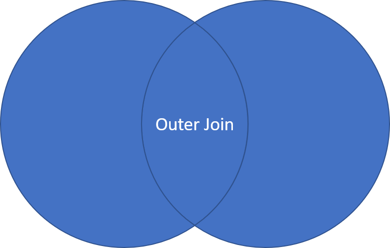
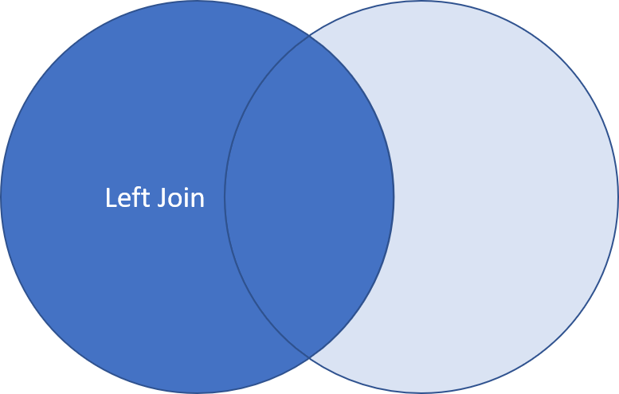
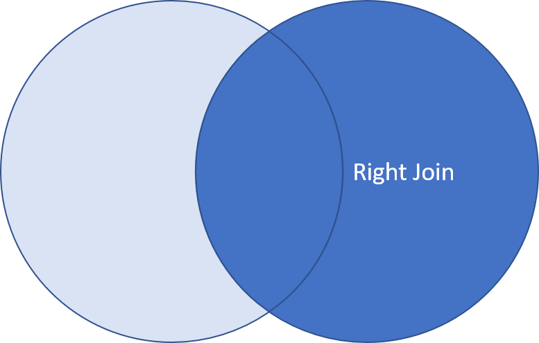

## Data Wrangling

- the combined process of data pre-processing and data transformation
- data pre-processing is the stage of cleaning data (e.g. empty values, repeated values)
- data transformation is the convertion of raw data to a useful data format

***

## Data Frames

What if we have data on all the company's customers, including information like their name, birthday, contract duration, etc. What would be the best structure to store all these data?

**Is it a matrix?** Matrices have a square structure that allows for quick comparisons acros columns and rows. This is good for anylsis. However, it can only store 1 data type. All our data will be stored as characters!

**Is it a list?** A list is flexible enough to allow for multiple data types. However, it lacks the square structure that a matrix has. It is hence more difficult to make comparisons or search in a list.

The ideal structure in this case is the **data frame**. Similar to the data frame structure in Python, it is a happy mixture of both the list and matrix data structures.

### Working with Data Frames

- each column contains values about a specific attribute of the data
- each row contains all information about a specific instance of the data
- within a column, the data type is the same
- between different columns, the data type can be different
- can be thought of as a list of vectors

Creating the data frame manually:

```{r}
# method 1
Name = c("James", "Joe", "Janice", "Jessica")
Position = c("CEO", "VF", "Manager", "Clerk")
Gender = c("M", "M", "F", "F")
Salary = c(30000, 13000, 9800, 3500)
employees = data.frame(Name, Position, Gender, Salary)

# method 2
employees = data.frame(Name=c("James", "Joe", "Janice", "Jessica"),
                        Position=c("CEO", "VF", "Manager", "Clerk"),
                        Gender=c("M", "M", "F", "F"),
                        Salary=c(30000, 13000, 9800, 3500))

employees
```

Read from an existing file:

```{r}
df = read.csv("./Data/SRX_Data.csv")
class(df)
```

### Accessing a Data Frame

```{r}
# single square bracket -> returns a data frame
employees[1]
class(employees[1])
```

```{r}
# double square brackets -> returns a vector
employees[[1]]
is.vector(employees[[1]])
```

```{r}
# dollar sign
employees$Position
is.vector(employees$Position)
```

```{r}
# indexing
employees[2,3]
employees[2, ]
```

### Naming

To facilitate searching, you can name the rows, provided all row names are unique.

```{r}
rownames(employees) = employees$Name
employees

# rows can then be accessed by their names
employees["Joe", "Salary"]
```

### Removing Columns

```{r}
employees$Name = NULL
employees
```

### Viewing Data Frames

- type View(df) into the console
- click on the table icon next to the df object in the environment tab

### Structure Information

```{r}
# dimensions
dim(employees)

# structure
str(employees)

# summary
summary(employees) # provides some basic statistics
```

***

## Manipulating Data Frames

```{r}
companies = read.csv("./Data/Largest Companies in the World.csv")
summary(companies)
```

### Maxima / Minima

```{r}
# finding extreme values
max(companies$Assets...billion.)
min(companies$Assets...billion.)
range(companies$Assets...billion.) # finds both
```

```{r}
# finding position of extreme values in the data frame
idx = which.max(companies$Assets...billion.) # gives the row number
companies[idx, "Company"]
```

### Sort

```{r}
# top 10
sorter = order(companies$Assets...billion., decreasing=T)
companies_sorted = companies[sorter, ]
head(companies_sorted, 10)$Company
```

### Count

```{r}
# returns table object with the counts stored as values
continents = table(companies$Continent) 

# convert to df for convenience
continents = as.data.frame((continents)) 

continents
```

### Filter

```{r}
condition = companies$Continent == "Asia" & 
              companies$Profits...billion. >= 30
result = companies[condition, ]

head(result)
```

### Average

```{r}
mean(companies$Market.Value...billion.)
```

***

## Package 'dplyr'

'dplyr' is a powerful package that helps to streamline a lot of data manipulation.

```{r}
library("dplyr")
```

### Filter

```{r}
# don't have to repeat companies in the logical operator
set1 = filter(companies, Continent == "Asia" 
              & Assets...billion. >= 50)

head(set1)
```

### Calculations

```{r}
# adds a new column
set2 = mutate(set1, Profit.Margin = 
                Profits...billion./Sales...billion.)
head(set2)
```

### Sort

```{r}
# ascending order by default
# add a negative to sort by descending order
set3 = arrange(set2, -Profit.Margin)
head(set3)
```

### Selection

```{r}
set4 = top_n(set3, 10)
select(set4, Company, Profit.Margin) # selects columns
```

### Pipe operator

Currently, we are using 4 intermediate data sets, which take up memory. dplyr has a pipe operator, "%>%", that pushes an argument to a function.

```{r}
set = companies %>% 
  filter(Continent == "Asia" & Assets...billion. >= 50) %>%
  mutate(Profit.Margin = Profits...billion./Sales...billion.) %>%
  arrange(-Profit.Margin) %>%
  select(Company, Profit.Margin)

head(set)
```

***

## Data Summary

- statistics summarised by some criteria
- similar to Pivot Table in Excel

### Group By and Summarise

First, we group by continents, then specify what we want summarised:

```{r}
companies %>% group_by(Continent) %>%             # group continents
  summarise(Max.Proft = max(Profits...billion.),  # define what to
            No.of.Companies = n(),                # summarise
            Avg.Asset = mean(Assets...billion.))
```

We can also group by multiple columns, use other dplyr operations or define our own functions to calculate our own summary values:

```{r}
my_func = function(x) {
  half1 = x[seq(1, length(x), 2)] # odd idx
  sq = mean(half1^2)              # square
  half2 = x[seq(2, length(x), 2)] # even idx
  rt = mean(half2^0.5)            # sqrt
  return(sq + rt)
}

companies %>% group_by(Continent) %>%
  summarise(Median.Proft = median(Profits...billion.),
            No.of.Companies = n(),
            My.Value = my_func(Assets...billion.))
```

***

## Data Format

Right now, the data we have is structured such that each column represents a unique attribute and each row, a unique record. This is called **tidy data** or **data in long format**.

But not all data is structured this way. Here, the columns and rows are flipped:

```{r}
house_w = read.csv("./Data/Home_Ownership_Rate.csv", check.names=F)

head(house_w)
```

This is called **data in wide format**.

Each format has their own advantages and disadvantages. You might consider one over the other depending on the type of statistics you want. 

### Data transformation

To transform one data format to the other, we use the "tidyr" package.

```{r}
library(tidyr)
```

Wide to long:

```{r}
# gather(column_names..., column_range)
house_l = house_w %>% gather(Year, Rate, 2:23)
head(house_l)

# negative can be used to exclude columns
house_l = house_w %>% gather(Year, Rate, -Property.Type)
head(house_l)
```

Long to wide:

```{r}
house_w = house_l %>% spread(Year, Rate)
head(house_w)
```

***

## Alternative Data

Alternative data is usually non-financial data, from non-traditional sources, used by investment professionals in their evaluation processes.

It is often about people or companies that can be used to gauge some statistics before any official reports are published. It can also supplement current data to give a more holistic view.

***

## Growing Data

- adding new attributes
- adding new records
- merging with new data sets

### 1. Adding New Attributes

```{r}
No.Of.Children = c(1, 2, 0, 2)
employees_1 = cbind(employees, No.Of.Children)
employees_1
```

## 2. Adding new records

```{r}
John = data.frame(Position="Clerk", Salary=2900, Gender="M", 
                  No.Of.Children=0)
employees_2 = rbind(employees_1, John=John)
employees_2
```

What if we have an missing column data or extra column data?

```{r}
# rbind does not work here
Jack = data.frame(Position="Engineer", Salary=2900, Gender="M", 
                  Education="B.Sc.")

# use bind_rows from dplyr package
employees_3 = bind_rows(employees_2, Jack=Jack) 
employees_3 # fills missing data with NA
```

### 3. Merging Data Sets

Data relations can be:
- 1-to-many (e.g. each country has many companies, each company belongs to 1 country)
- 1-to-1 (e.g. each company has 1 CEO, each CEO only in charge of 1 company)
- many-to-many (e.g. each company has many customers, each customer associates with many companies)

```{r}
countries = read.csv("./Data/Countries.csv")
head(countries)
```

Inner join:

- returns only the rows in companies which have matching country names in countries
- aka only companies both in countries and companies data sets

{width=50%}

```{r}
set1 = merge(companies, countries, by="Country")
head(set1) # "The Netherlands" dropped, not matching with "Netherlands"
```

Outer join:

- returns all rows from both companies and countries, joining records from companies which have matching keys in countries
- aka all countries from companies and contries data sets

{width=50%}

```{r}
set2 = merge(companies, countries, by="Country", all=T)
head(set2) # missing data filled with NA
```

Left join:

- returns all rows from countries with data from companies wherever there are matching keys
- aka all countries in companies data set

{width=50%}

```{r}
set3 = merge(companies, countries, by="Country", all.x=T)
head(set3)
```

Right join:

- returns all rows from companies with data from countries wherever there are matching keys
- aka all countries in countries data set

{width=50%}

```{r}
set4 = merge(companies, countries, by="Country", all.y=T)
head(set4)
```

## Native R

```{r}
attach(employees) # adds column names to search path
Position

detach(employees) # removes column names
# Position        # throws error
```