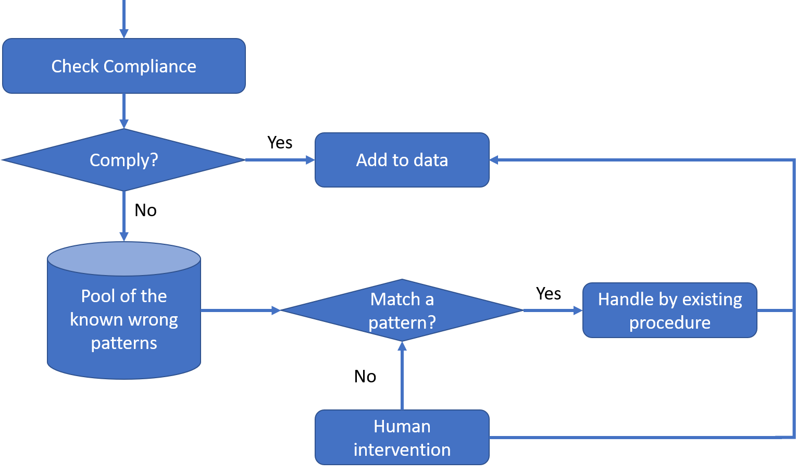

## Error catching and warnings

- stop: throws an error, terminates programme
- warning: throws a warning, programme continues
- tryCatch: anything not caught by test cases, terminates without crashing programme
- finally: wrap up programme after error (e.g. closing connections)

```{r}
GetMax0or1 = function(m, tie_breaker=1, by_row=T) {
  tryCatch ({
    # error catching
    allowed = c(0,1)
    ## m
    if (!is.matrix(m)) {
      stop("Illegal arguments: m is not a matrix\n")
    }
    if (sum(!(m %in% allowed)) > 0) {
      stop("Illegal arguments: m contains elements other than 0 and 1\n")
    }
    ## tie_breaker
    if (!(tie_breaker %in% allowed)) {
      stop("Illegal arguments: tie_breaker is neither 0 nor 1\n")
    }
    ## by_row
    if (!(by_row %in% allowed)) {
      stop("Illegal arguments: by_rows is not a logical input\n")
    }
    
    # warnings
    # matrix contains True/False -> convert to 1/0
    
    
    # check rows/col, depending on by_row
    sum = NA
    if (by_row) {
      sum = apply(m, 1, sum)
    } else {
      sum = apply(m, 2, sum)
    }
    
    # check majority, depending on tie breaker
    res = NA
    if (tie_breaker) {
      res = as.integer(sum >= ncol(m)/2)
    } else {
      res = as.integer(sum > ncol(m/2))
    }
    return(res)
  }, error=function(errorMessage){
    message(errorMessage)
  }, warning=function(warningMessage){
    message(warningMessage)
  }, finally={
  })
}

m = matrix(c(1,0,1,1,1,1,0,0,1,0,0,0), ncol=3, byrow=T)
GetMax0or1(m)
```

## Data Cleaning



```{r}
families = read.csv("./Data/The family with the largest number of children.csv")

# match regex = "^([FM],)+[FM]$"
```

